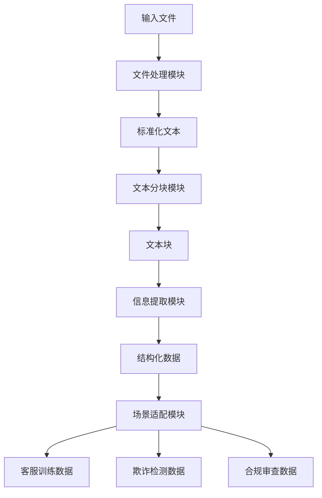

# SmartFinData——基于AI驱动与NLP技术的金融数据智能处理系统

## 挑战背景
在花旗，数据科学家们肩负着通过微调大语言模型（LLMs）来改进各种金融应用的重要任务，例如客户服务聊天机器人、提供欺诈检测常规监控和个性化的金融建议等。然而，其中一个关键挑战在于如何将客户提供的大量非结构化信息文档转换为适合特定模型训练需要的结构化数据集。利用AI自动处理、分块和提取这些文档中的相关信息，能够显著提高模型微调的效率和准确性。

## 挑战描述
开发一个基于AI的系统，该系统能够自动将用户提供的文档转换为结构化数据集，以适应不同的金融应用场景的LLM微调。该系统需要具备处理各种文档格式的能力，并实现高级数据处理技术，如分块、检索、摘要、问答生成和文本分析。目标是确保处理后的数据集具有意义且上下文准确，从而促进以下场景的模型微调：
- **客户服务聊天机器人**：生成可以有效理解和回应广泛客户询问的训练数据。
- **欺诈检测**：从交易数据中提取模式和异常，以训练可以识别和预防欺诈行为的模型。
- **合规监控**：总结法规和合规文件，以帮助模型确保遵守金融法规。

此外，该系统应确保数据安全、保持客户隐私，并适应不同类型的文档和金融应用场景。

## 系统模块介绍

### 模块一：文件处理模块
1. **核心功能**
   - 支持多种文件格式的读取和解析（PDF、Word、Excel、CSV、JSON）
   - 自动检测和处理文件编码
   - 提取文档结构和格式信息
   - 统一输出标准化的文本格式

2. **代码结构**
```python
document_processing/
├── document_processor.py     # 统一处理入口
├── processors/              # 各类型处理器
│   ├── pdf_processor.py     # PDF文件处理
│   ├── docx_processor.py    # Word文件处理
│   ├── excel_processor.py   # Excel文件处理
│   ├── csv_processor.py     # CSV文件处理
│   └── json_processor.py    # JSON文件处理
└── utils/
    ├── encoding_detector.py # 编码检测工具
    └── format_converter.py  # 格式转换工具
```

3. **核心技术**
   - 文件编码自动检测（使用chardet库）
   - 文档结构保留技术
   - 智能分页识别
   - 表格结构提取

4. **设计特点**
   - 模块化设计：每种文件类型独立处理
   - 统一输出格式：标准化的文本结构
   - 异常处理机制：详细的错误日志
   - 可扩展性：易于添加新的文件类型支持

### 模块二：文本分块模块
1. **核心功能**
   - 将长文本分割成适合处理的小块
   - 保持文本的语义完整性
   - 维护块之间的关联关系
   - 支持多种分块策略

2. **代码结构**
```python
text_chunking/
├── chunk_manager.py      # 分块管理器
├── chunk_strategies.py   # 分块策略实现
├── chunk_processor.py    # 分块处理器
└── utils/
    ├── text_splitter.py  # 文本分割工具
    └── context_keeper.py # 上下文维护工具
```

3. **核心技术**
   - 滑动窗口分块算法
   - 基于GPT2的分词技术
   - 语义完整性检查
   - 上下文关联维护

4. **设计特点**
   - 三种分块策略：
     * 固定窗口分块：适用于规整文本
     * 语义感知分块：保持语义完整
     * 结构感知分块：保留文档结构

### 模块三：信息提取模块
1. **核心功能**
   - 识别文本中的关键实体
   - 提取实体间的关系
   - 检测异常模式
   - 生成文本摘要
   - 智能文本长度控制
   - 离线实体识别

2. **代码结构**
```python
information_extraction/
├── extractor/
│   ├── entity_extractor.py    # 实体提取
│   ├── relation_extractor.py  # 关系提取
│   └── pattern_detector.py    # 模式检测
├── analyzer/
│   ├── text_analyzer.py       # 文本分析
│   └── summary_generator.py   # 摘要生成
└── utils/
    └── nlp_tools.py          # NLP工具集
```

3. **核心技术**
   - 基于规则的命名实体识别（NER）
   - 关系抽取
   - 文本分类
   - 智能摘要生成
   - 动态长度控制算法
   - 离线文本处理

4. **设计特点**
   - 多级信息提取
   - 实体关系图谱构建
   - 异常模式识别
   - 可配置的提取规则
   - 智能文本压缩
   - 高性能离线处理

5. **优化亮点**
   - **智能长度控制**：根据文本长度自动计算最优摘要长度
     * 短文本（≤100字符）：保持原文
     * 中等文本（≤500字符）：压缩至原文一半
     * 长文本（>500字符）：压缩至原文三分之一
   - **离线处理能力**：
     * 无需依赖外部模型
     * 基于TF-IDF的句子重要性评分
     * 考虑文档结构的智能句子选择
   - **鲁棒性增强**：
     * 完善的异常处理机制
     * 智能文本截断保护
     * 上下文感知的句子选择
   - **性能优化**：
     * 内存使用优化
     * 处理速度提升
     * 稳定性增强

### 模块四：场景适配模块
1. **核心功能**
   - 客服对话生成
   - 欺诈交易检测
   - 合规审查支持

2. **代码结构**
```python
scenario_adaptation/
├── services/
│   ├── customer_service.py   # 客服场景
│   ├── fraud_detection.py    # 欺诈检测
│   └── compliance_check.py   # 合规审查
└── utils/
    ├── dialog_generator.py   # 对话生成
    └── pattern_matcher.py    # 模式匹配
```

3. **核心技术**
   - 对话生成算法
   - 交易模式分析
   - 规则匹配引擎

4. **设计特点**
   - 场景自动识别
   - 模板化处理流程
   - 可定制化规则配置

## 数据处理流程



## 环境配置

### 1. 基础环境要求
- Python 3.7+
- pip 包管理器
- 4GB+ 内存
- 2GB+ 磁盘空间

### 2. 依赖安装
```bash
# 安装核心依赖
pip install -r requirements.txt

# 主要依赖包括
pandas==1.3.3
numpy==1.21.2
python-docx==0.8.11
PyPDF2==2.10.5
chardet==4.0.0
```

### 3. 运行方式
```bash
# 1. 创建数据目录
mkdir data output

# 2. 放入待处理文件
cp your_files/* data/

# 3. 运行处理程序
python run_processing.py

# 4. 查看输出结果
cd output/
```

### 4. 配置文件说明
- `config/settings.py`: 全局配置
- `config/logging.py`: 日志配置
- `config/rules.py`: 处理规则配置