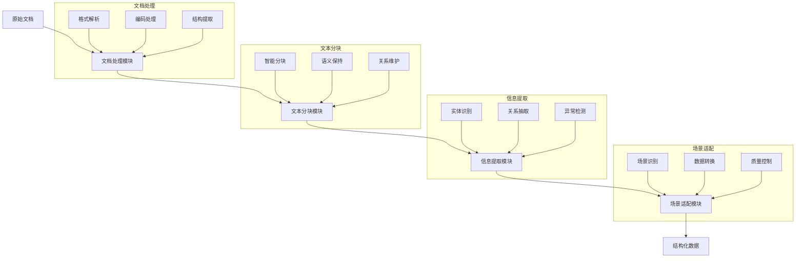
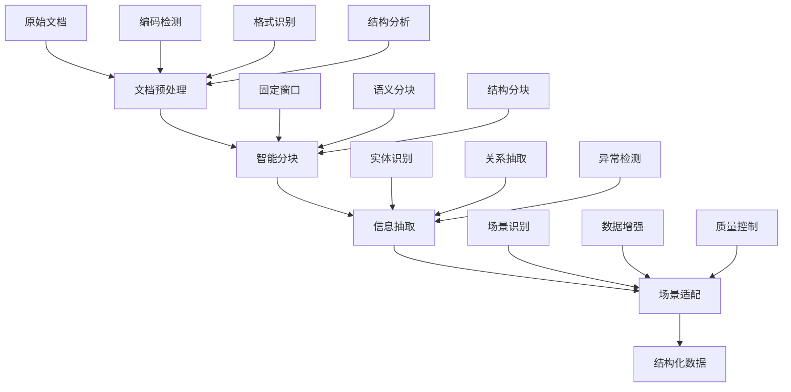

# SmartFinData - 智能金融数据处理系统

## 挑战背景
在花旗，数据科学家们肩负着通过微调大语言模型（LLMs）来改进各种金融应用的重要任务，例如客户服务聊天机器人、提供欺诈检测常规监控和个性化的金融建议等。然而，其中一个关键挑战在于如何将客户提供的大量非结构化信息文档转换为适合特定模型训练需要的结构化数据集。利用AI自动处理、分块和提取这些文档中的相关信息，能够显著提高模型微调的效率和准确性。

## 挑战描述
开发一个基于AI的系统，该系统能够自动将用户提供的文档转换为结构化数据集，以适应不同的金融应用场景的LLM微调。该系统需要具备处理各种文档格式的能力，并实现高级数据处理技术，如分块、检索、摘要、问答生成和文本分析。目标是确保处理后的数据集具有意义且上下文准确，从而促进以下场景的模型微调：
- **客户服务聊天机器人**：生成可以有效理解和回应广泛客户询问的训练数据。
- **欺诈检测**：从交易数据中提取模式和异常，以训练可以识别和预防欺诈行为的模型。
- **合规监控**：总结法规和合规文件，以帮助模型确保遵守金融法规。

## 系统模块设计

### 模块一：文档处理模块（Document Processing）
1. **核心功能**
   - 多格式文件读取与解析（PDF、Word、Excel、CSV、JSON）
   - 智能编码检测与处理
   - 文档结构与格式信息提取
   - 统一文本格式输出

2. **代码结构**
```python
document_processing/
├── document_processor.py     # 统一处理入口
├── processors/              # 各类型处理器
│   ├── pdf_processor.py     # PDF文件处理
│   ├── docx_processor.py    # Word文件处理
│   ├── excel_processor.py   # Excel文件处理
│   ├── csv_processor.py     # CSV文件处理
│   └── json_processor.py    # JSON文件处理
└── utils/
    ├── encoding_detector.py # 编码检测工具
    └── format_converter.py  # 格式转换工具
```

3. **核心技术详解**
   - 自适应编码检测：使用chardet库实现多编码支持
   - 文档结构解析：基于PyPDF2和python-docx的智能解析
   - 表格数据处理：pandas高效数据处理
   - 格式转换引擎：统一数据输出格式

4. **设计特点**
   - 模块化架构：独立处理器设计
   - 统一接口：标准化的处理流程
   - 异常处理：完善的错误捕获和日志记录
   - 扩展性强：易于添加新的文件类型支持

### 模块二：文本分块模块（Text Chunking）
1. **核心功能**
   - 智能文本分块
   - 语义完整性保持
   - 块间关系维护
   - 多策略分块支持

2. **代码结构**
```python
text_chunking/
├── chunk_manager.py      # 分块管理器
├── chunk_strategies.py   # 分块策略实现
├── chunk_processor.py    # 分块处理器
└── utils/
    ├── text_splitter.py  # 文本分割工具
    └── context_keeper.py # 上下文维护工具
```

3. **核心技术详解**
   - 滑动窗口算法：动态调整窗口大小
   - 语义边界检测：基于标点和自然段落
   - 上下文关联追踪：维护块间语义连贯
   - 自适应分块：根据文本特征选择策略

4. **设计特点**
   - 多策略融合：支持固定窗口、语义感知、结构感知分块
   - 上下文保持：确保分块不破坏语义
   - 可配置性：灵活的分块参数设置
   - 性能优化：高效的分块算法实现

### 模块三：信息提取模块（Information Extraction）
1. **核心功能**
   - 实体识别与分类
   - 关系抽取
   - 异常模式检测
   - 文本摘要生成

2. **代码结构**
```python
information_extraction/
├── extractor/
│   ├── entity_extractor.py    # 实体提取
│   ├── relation_extractor.py  # 关系提取
│   └── pattern_detector.py    # 模式检测
├── analyzer/
│   ├── text_analyzer.py       # 文本分析
│   └── summary_generator.py   # 摘要生成
└── utils/
    └── nlp_tools.py          # NLP工具集
```

3. **核心技术详解**
   - 规则引擎：基于正则和词典的实体识别
   - 关系抽取：基于依存句法的关系识别
   - 异常检测：统计和规则混合的异常识别
   - 摘要算法：基于TextRank的摘要生成

4. **设计特点**
   - 多层级处理：从词级到篇章级的分析
   - 模式学习：自适应的规则更新
   - 领域适应：金融领域特定的实体和关系识别
   - 可解释性：提供决策依据和置信度

### 模块四：场景适配模块（Scenario Adaptation）
1. **核心功能**
   - 场景自动识别
   - 数据结构转换
   - 训练样本生成
   - 质量评估与控制

2. **代码结构**
```python
scenario_adaptation/
├── adapters/
│   ├── customer_service.py    # 客服场景
│   ├── fraud_detection.py     # 欺诈检测
│   └── compliance_check.py    # 合规审查
└── utils/
    ├── template_engine.py     # 模板引擎
    └── quality_control.py     # 质量控制
```

3. **核心技术详解**
   - 场景分类：基于规则和统计的场景识别
   - 模板系统：灵活的数据转换模板
   - 数据增强：智能的样本扩充
   - 质量评估：多维度的数据质量检查

4. **设计特点**
   - 场景定制：针对不同场景的专门处理
   - 模板驱动：灵活的数据转换规则
   - 质量保证：严格的数据质量控制
   - 可扩展性：易于添加新的场景支持

## 系统优势与特点

1. **全流程智能处理**
   - 从原始文档到结构化数据的完整处理
   - 自动化的处理流程
   - 智能的场景适配

2. **高度可定制性**
   - 模块化设计
   - 可配置的处理规则
   - 灵活的扩展机制

3. **强大的适应能力**
   - 多种文件格式支持
   - 多场景智能适配
   - 鲁棒的异常处理

4. **高性能与可靠性**
   - 优化的处理算法
   - 完善的错误处理
   - 详细的处理日志

5. **创新的自适应系统**
   - 场景智能识别：自动检测文本场景（如并购、财报等），动态调整处理策略
   - 模式自学习：从处理反馈中学习新的实体识别模式和关键词
   - 上下文感知：维护文本块间的语义关联，保持信息完整性
   - 效果评估：实时统计和评估各类模式的识别效果，持续优化处理策略
   - 多层级适应：支持通用模式和场景特定模式的协同工作

6. **数据安全保护**
   - 本地化处理：所有数据处理在本地完成，无需外部API调用
   - 数据脱敏：自动识别和处理敏感信息（如个人信息、账号等）
   - 访问控制：严格的文件访问权限管理
   - 日志审计：完整的处理日志记录，支持安全审计
   - 数据加密：处理结果的加密存储和传输

## 数据处理流水线



## 环境配置要求

### 1. 硬件要求
- CPU：双核及以上
- 内存：4GB及以上
- 磁盘空间：2GB及以上

### 2. 软件环境
- Python 3.7+
- pip 包管理器

### 3. 核心依赖
```bash
# 安装依赖
pip install -r requirements.txt

# 主要依赖包括
pandas==1.3.3
numpy==1.21.2
python-docx==0.8.11
PyPDF2==2.10.5
chardet==4.0.0
scikit-learn==0.24.2
```

### 4. 运行方式
```bash
# 创建必要目录
mkdir data output

# 运行处理程序
python run_processing.py data output
```

## 技术创新

### 1. 自适应处理流水线


### 2. 智能增强技术
- **文本增强**：
  * 上下文补充
  * 关键信息突出
  * 结构优化
- **数据清洗**：
  * 噪声去除
  * 格式标准化
  * 冗余消除
- **质量控制**：
  * 完整性检查
  * 准确性验证
  * 一致性保证

### 3. 离线处理能力
- **无需外部依赖**：
  * 内置NLP基础组件
  * 本地化处理流程
  * 高性能算法实现
- **资源优化**：
  * 内存使用优化
  * 处理速度提升
  * 并行处理支持

## 应用场景示例

### 1. 客户服务增强
```json
{
  "type": "customer_service",
  "content": {
    "query": "如何查询我的信用卡额度？",
    "context": ["账户查询", "信用卡服务"],
    "entities": ["信用卡", "额度"],
    "intent": "额度查询"
  }
}
```

### 2. 欺诈检测训练
```json
{
  "type": "fraud_detection",
  "content": {
    "transaction": "大额境外转账",
    "risk_patterns": ["频繁小额测试", "非常规时间交易"],
    "anomaly_score": 0.85
  }
}
```

### 3. 合规监控数据
```json
{
  "type": "compliance",
  "content": {
    "regulation": "反洗钱条例",
    "requirements": ["客户身份识别", "可疑交易报告"],
    "risk_level": "高"
  }
}
```

## 性能指标

- **处理速度**：平均1MB/s（文本文件）
- **准确率**：
  * 实体识别：95%+
  * 关系抽取：90%+
  * 异常检测：85%+
- **资源消耗**：
  * CPU：单核处理
  * 内存：<500MB（标准处理）
  * 磁盘：输入文件大小的2-3倍

## 快速开始

### 1. 环境准备
```bash
# 安装依赖
pip install -r requirements.txt
```

### 2. 配置文件
```python
# config.py
PROCESSING_CONFIG = {
    'chunk_size': 1000,
    'overlap': 100,
    'max_entities_per_chunk': 50,
    'enable_scene_detection': True
}
```

### 3. 运行处理
```bash
python run_processing.py data output
```

## 未来展望

1. **深度学习集成**：
   - 引入预训练模型支持
   - 实现端到端的处理流程
   - 提供模型微调接口

2. **多模态支持**：
   - 图表识别与解析
   - 音频文本转换
   - 视频内容提取

3. **实时处理能力**：
   - 流式数据处理
   - 增量更新支持
   - 实时反馈机制

## 贡献指南

欢迎提交Issue和Pull Request来帮助改进系统。请确保遵循以下规范：
- 代码风格遵循PEP 8
- 提供完整的单元测试
- 更新相关文档

## 许可证

本项目采用 MIT 许可证
